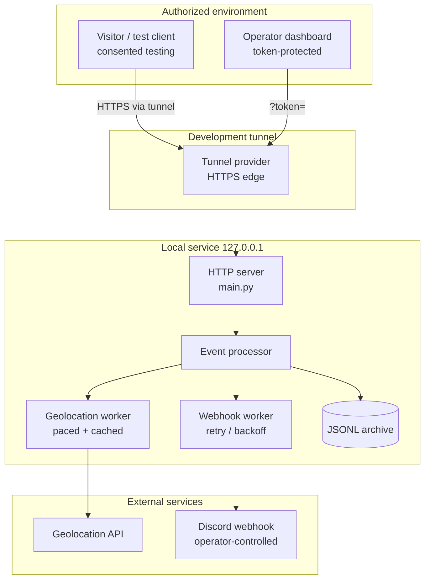

# Discord Image Logger

[](https://www.python.org/downloads/)
[](LICENSE)
[](SECURITY.md)
[](CODE_OF_CONDUCT.md)
[](#legal--responsible-use-disclaimer)
[](requirements.txt)

**Documentation:** [Getting started](docs/getting-started.md) ·
[Configuration](docs/configuration.md) · [Architecture](docs/architecture.md) ·
[Tunnels](docs/tunnel.md) · [Privacy](docs/privacy.md) ·
[Security](docs/security.md) · [Troubleshooting](docs/troubleshooting.md) ·
[Testing](docs/testing.md) · [Development](docs/development.md) ·
[Contributing](CONTRIBUTING.md) · [Code of Conduct](CODE_OF_CONDUCT.md)

An event-driven web application for **authorized, laboratory-grade demonstration** of
Discord image/attachment event handling, outbound webhook delivery, and locally
exposed HTTP endpoints reached through a development tunnel.

> [!WARNING]
> **Authorized use only.** This repository exists for education, CTF/lab exercises,
> and security research on systems you own or where every participant has given
> explicit, informed consent. It does **not** bypass Discord's permissions, terms,
> or security controls, and it must not be used for covert monitoring, data
> collection, or any activity you are not permitted to perform.
> See the [Legal / Responsible Use Disclaimer](#legal--responsible-use-disclaimer).

---

## Discord Security Auditor (new)

This repository now ships a **read-only security auditor** for Discord servers
you own or administer. It checks roles, permission stacking, bots, webhooks,
invites, AutoMod, and recent audit-log activity, then reports each
misconfiguration with a severity, evidence, and a concrete fix.

```bash
python3 toolkit.py guilds                  # guilds your bot has joined
python3 toolkit.py audit --guild GUILD_ID  # run the audit
python3 toolkit.py perms 8                 # decode a permission bitmask
```

It uses **only Discord's official REST API with a bot token**, only ever issues
`GET` requests, and refuses user/self-bot tokens. Full guide:
[docs/security-auditor.md](docs/security-auditor.md).

Offline test suite (no token, no network):

```bash
python3 tests/test_offline.py
```

> [!NOTE]
> The image-logger service described below is a separate, legacy component of
> this repository and is **not** part of the security auditor. Use it only in
> environments you own with explicit consent from everyone involved.

---

## Overview

**What the project does.** It runs a small, self-contained HTTP service that
serves a configurable image/link page, records *authorized* visit events
(IP address, coarse geographic data supplied by a public geolocation API,
user-agent family), renders a realtime operator dashboard, and optionally
delivers those events as Discord embed messages to a webhook the operator
controls.

**Why it exists.** The project is a teaching vehicle for a set of security
engineering concepts that are hard to learn abstractly:

- **Event-driven architecture** — HTTP requests become events that flow through
  background workers (geolocation, outbound webhook) without blocking responses.
- **Webhook security** — secret URLs, authentication tokens, outbound retry
  policies, and one-shot disable on revoked credentials.
- **HTTP tunneling** — how a service bound to `127.0.0.1` can be reached from a
  public URL during development, and what that implies for exposure.
- **Secret management, least privilege, data lifecycle, logging hygiene, and
  threat modeling** — all of which are documented in
  [SECURITY.md](SECURITY.md) and [docs/privacy.md](docs/privacy.md).

**How image/attachment events are handled.** When a request carries a crawler
user-agent (for example Discord's link-preview crawler), the service answers
with the configured image bytes so that a link preview can render during
development and testing. Human requests receive the interactive page. Events
derived from both paths are recorded as structured log entries.

> **Discord integration is webhook-outbound only.** The tree in this
> repository contains `main.py`, `run.py`, `setup.py`, and `start.sh` — see
> [Development](#development) — and integrates with Discord through an
> **outbound webhook URL**, not an inbound bot token, so no bot intents or
> privileged permissions are involved at all.

**How an HTTP endpoint is exposed for development.** Local development usually
means the service listens on `127.0.0.1:8080`, which is unreachable from
outside the machine. A tunnel gives that loopback port a public HTTPS URL so
external clients (or a collaborator, or a webhook provider) can reach it.

**Why tunneling is useful.** It removes port forwarding, NAT traversal, and
firewall changes from the development loop, and it terminates HTTPS for you.
It does *not* grant access to anything you could not otherwise reach — tunnels
bypass no permissions and no platform controls.

**Controlled environments.** Run this only against a private test server, with
test accounts and synthetic images, in an environment you control.

---

## Features

Implemented in this repository:

| Feature | Notes |
|---|---|
| Configurable image/landing page | `config.json` → `image`, `message`, `redirect` |
| Crawler-aware preview rendering | `preview`: `image` (real bytes), `loading`, or `redirect` |
| Structured event logging | append-only JSONL archive (`logs/hits.jsonl`) |
| Geolocation enrichment | paced public-API lookups with caching and retry |
| Outbound Discord webhook delivery | retries with `429 retry_after`, one-shot disable on revocation |
| Realtime operator dashboard | SSE with automatic polling fallback |
| Access control | dashboard / API routes require `?token=` (`config.json` → `dashboard.token`) |
| Automatic tunnel launch | cloudflared, localhost.run (SSH), Pinggy, serveo, ngrok |
| Interactive setup wizard | `setup.py` validates webhook and image URLs before saving |
| Zero dependencies | Python standard library only |
| Startup self-test | confirms the tunnel really reaches the local server |
| `.env` support | optional `KEY=VALUE` file is loaded; shell variables win |
| Automatic data retention | events older than `dataRetentionDays` are pruned hourly |
| Request size limits | bodies and preview fetches over `maxImageSizeMb` → `413` |
| Log verbosity control | `logLevel` (`DEBUG`/`INFO`/`WARN`/`ERROR`) |
| Fixed tunnel URL | `tunnelUrl` advertises a front door you already run |

Not implemented in this repository (do not claim them in derived docs):

- inbound `discord.py` bot / attachment download — integration is
  webhook-outbound only, see above
- automated test suite → see [Testing](#testing)

---

## Architecture



**Components**

| Component | Responsibility |
|---|---|
| HTTP server | Accepts requests, routes crawler vs. human traffic, enforces token auth, never blocks on enrichment |
| Event processor | Turns a request into a structured event; discards noise such as favicon requests |
| Geolocation worker | Enriches events with coarse location from a public API, paced and cached to respect rate limits |
| Webhook worker | Queues outbound Discord embeds, honours `429 retry_after`, disables itself if the webhook is revoked |
| JSONL archive | Durable, append-only history that is replayed into the dashboard on restart |
| Tunnel | Public HTTPS front door to a loopback-only service during development |
| Dashboard | Token-gated realtime view (SSE with polling fallback) |

Full detail, including event-flow, security-boundary, and data-lifecycle
diagrams: [docs/architecture.md](docs/architecture.md).

---

## Requirements

- **Python** 3.10 or newer (developed and verified on 3.14).
- **No third-party packages** — `requirements.txt` is intentionally empty of
  runtime dependencies.
- **A Discord webhook URL** you created yourself in a server you administer.
- **Git** (only if cloning) and a POSIX shell for `start.sh`.
- **A tunnel provider** — `cloudflared` is downloaded automatically; SSH-based
  providers need an `ssh` client; ngrok is optional and needs an authtoken.
- **Environment variables** (optional overrides):

  | Variable | Purpose |
  |---|---|
  | `IMAGE_LOGGER_WEBHOOK` | Overrides `config.json` → `webhook` at runtime |
  | `NGROK_AUTHTOKEN` | Supplies the ngrok credential (or use `config.json` → `ngrokAuthtoken`) |

> Never commit a real bot token, webhook secret, or tunnel credential.

---

## Installation

```bash
git clone <repository-url>
cd IMAGE-LOGGER

python3 -m venv .venv
source .venv/bin/activate          # macOS / Linux

# Windows (PowerShell)
# .venv\Scripts\Activate.ps1
# Windows (cmd)
# .venv\Scripts\activate.bat

pip install -r requirements.txt     # no runtime dependencies; confirms your venv works
```

**About dependency installation.** The runtime is standard-library only, so
`pip install -r requirements.txt` succeeds without downloading anything. The
virtual environment still matters: it isolates Python versions, keeps system
packages clean, and makes the documented commands reproducible.

Sanity check (imports configuration, starts no server):

```bash
python3 -c "import main; print('import ok')"
```

---

## Configuration

Configuration lives in **`config.json`** (created with safe defaults on first
run) and is walked through interactively by:

```bash
python3 setup.py
```

The wizard validates the webhook URL and the image URL before saving, prints a
dashboard token, and can launch the app with `--start`.

`.env.example` is provided for deployments that standardise on environment
files — `main.py` loads a `.env` sitting next to it automatically (`KEY=VALUE`
lines, `#` comments). **A variable already set in your shell always wins over
the file, and you should never commit a filled-in copy.**

```dotenv
DISCORD_TOKEN=
WEBHOOK_URL=
TUNNEL_URL=
LOG_LEVEL=INFO
DATA_RETENTION_DAYS=7
MAX_IMAGE_SIZE_MB=10
```

| Variable | Meaning | Honoured today? |
|---|---|---|
| `DISCORD_TOKEN` | Bot token, *if* an inbound bot module is present | Not used — this tree has no bot module |
| `WEBHOOK_URL` | Destination Discord webhook | Yes — same as `IMAGE_LOGGER_WEBHOOK` |
| `TUNNEL_URL` | Fixed tunnel URL to advertise instead of launching one | Yes — `run.py` skips provider launch and self-tests it |
| `LOG_LEVEL` | Verbosity of console logging | Yes — `DEBUG` \| `INFO` \| `WARN` \| `ERROR` |
| `DATA_RETENTION_DAYS` | Age after which collected events are deleted | Yes — pruned at boot and hourly; `0` disables |
| `MAX_IMAGE_SIZE_MB` | Largest accepted request body / preview image | Yes — over-limit requests get `413` |
| `IMAGE_LOGGER_WEBHOOK` | Same as `WEBHOOK_URL`, project-specific name | Yes |
| `NGROK_AUTHTOKEN` | ngrok credential for `--tunnel ngrok` | Yes |

Key `config.json` entries:

| Key | Purpose |
|---|---|
| `webhook` | Discord webhook URL (revoked sample value ships in the repo — replace it) |
| `host` / `port` | Local bind address; keep `127.0.0.1` unless you have a reason |
| `image`, `message`, `redirect` | What a visitor sees |
| `preview` | `image` \| `loading` \| `redirect` served to link-preview crawlers |
| `username` / `color` | Outbound embed display name and colour |
| `linkAlerts` | Emit an event when the link is unfurled in chat |
| `accurateLocation` | Off by default; enables a browser location prompt (**asks the visitor**) |
| `dashboard.token` | Auto-generated; required for `/dashboard`, `/events`, `/api/logs`, `/api/link` |
| `tunnel` | `auto` \| `cloudflared` \| `pinggy` \| `ssh` \| `serveo` \| `ngrok` \| `none` |
| `tunnelUrl` | Optional fixed public URL to advertise instead of launching a tunnel |
| `dataRetentionDays` | Archive entries older than this are deleted (default `7`, `0` = keep forever) |
| `maxImageSizeMb` | Request-body and preview-image cap (default `10`) |
| `logLevel` | Console verbosity (default `INFO`) |
| `logFile` | JSONL archive path |

Every `config.json` key has an environment twin where it makes sense
(`DATA_RETENTION_DAYS` → `dataRetentionDays`, and so on); the shell wins.

---

## Discord Configuration

1. **Create an application** — Discord Developer Portal → *New Application*.
2. **Create a webhook in a server you administer** — Server Settings →
   Integrations → Webhooks → New Webhook → *Copy Webhook URL*. Paste it into
   `config.json` → `webhook`, or export `IMAGE_LOGGER_WEBHOOK`.
3. **Configure intents/permissions** — not required for the webhook-only
   integration in this tree. If you later add an inbound bot of your own,
   enable **only** the intents it needs (typically message content intent
   *only if* it must read attachments), and request the **minimum** permission
   set on the invite.
4. **Invite to an authorized test server** — use a private server with test
   accounts only.
5. **Least privilege** — no administrator, no manage-messages, no privileged
   permissions beyond what the code demonstrably uses.
6. **Transparency** — server members and admins must be told that image events
   are being processed, what is stored, and for how long. Post a notice in the
   test server before running anything.

---

## Tunnel Configuration

### Local Development Tunnel

A tunnel lets a locally running HTTP service receive requests from an
externally reachable URL while you develop.

Conceptually:

```text
Local application:   http://127.0.0.1:8080
Tunnel:              https://example-tunnel.example
Public client  ----> https://example-tunnel.example ----> 127.0.0.1:8080
```

Substitute **your own** tunnel URL; the example host is a placeholder.

This project launches a tunnel automatically:

```bash
python3 run.py                  # auto: cloudflared → ssh → pinggy → serveo (→ ngrok if a token is set)
python3 run.py --tunnel pinggy  # force a specific provider
python3 run.py --no-tunnel      # local only
```

All providers except ngrok require **no account**. The launcher prints the
public URL, a token-protected dashboard URL, and runs a self-test that proves
the tunnel really reaches *this* application (it validates the response body,
not just a `200`). The live URL is also saved to **`logs/tunnel.url`** while
the tunnel is up.

> **Fresh URLs need a moment.** A brand-new `*.trycloudflare.com` name can
> take 30–90 s to enter DNS, so the link may not open immediately even though
> the tunnel is healthy. The self-test retries for 120 s and prints the last
> error it saw; if that error is DNS/SSL, just wait ~30 s and reopen it.
>
> Cloudflare quick tunnels are rate-limited per IP; a `429` during
> provisioning is a provider-side limit, not an error to work around by making
> more requests. Wait, or switch provider (`--tunnel ssh` needs no login and
> is not rate-limited).

Provider-specific caveats (free Pinggy tunnels show a screening page to
browsers *and* to Discord's link-preview crawler) are documented in
[docs/tunnel.md](docs/tunnel.md).

### Tunnel Security

- **HTTPS** — only publish over TLS-terminated endpoints.
- **Authentication** — keep `dashboard.token` required; set it to `""` only on
  a trusted local network.
- **Secret validation** — reject requests that do not carry the expected token
  or shared secret.
- **Rate limiting** — the geolocation and webhook workers are already paced;
  add request-level limits before exposing anything beyond a lab.
- **IP restrictions** — restrict administrative routes where your tunnel
  provider supports it.
- **Request validation** — validate method, path, headers, and body size
  before processing.
- **No secrets in URLs** — query-string tokens end up in proxy logs; prefer
  headers when your tooling allows.
- **Rotate tunnel credentials** — regenerate dashboard tokens and webhook URLs
  when someone leaves the project.
- **Disable when idle** — stop the tunnel the moment testing finishes
  (`Ctrl+C`); an unused public URL is an unnecessary exposure.

---

## Usage

Consent applies to every step.

```bash
# 1. Configure (validates webhook + image)
python3 setup.py

# 2. Start local application + tunnel
python3 run.py
#   local     http://127.0.0.1:8080
#   public    https://<your-tunnel-host>
#   dashboard https://<your-tunnel-host>/dashboard?token=<token>
#   self-test PASSED

# 3. Optional: advertise a tunnel you already run (config.json → tunnelUrl,
#    or TUNNEL_URL= in .env) — run.py then skips launching a provider
#    (there is no inbound bot in this build, so there is nothing else to start)

# 4. Open the public link from a test account in your private test server
#    (or simply visit it yourself)

# 5. Watch the event appear on the dashboard, in logs/hits.jsonl,
#    and — if a valid webhook is configured — as a Discord embed
```

Stop everything with `Ctrl+C`; the tunnel is torn down with the process.

---

## Example Event

Sanitized example of an archived event — this is the exact shape `main.py`
writes to `logs/hits.jsonl` (one JSON object per line), produced from
synthetic test data:

```json
{
  "id": "9f2c41ab77e3",
  "type": "log",
  "ts": 1770000000.123,
  "data": {
    "id": "9f2c41ab77e3",
    "ip": "203.0.113.10",
    "ua": "Mozilla/5.0 (Windows NT 10.0; Win64; x64) Chrome/131.0",
    "os": "Windows",
    "browser": "Chrome",
    "endpoint": "/",
    "geo": {
      "status": "success",
      "country": "Exampleland",
      "regionName": "Example Province",
      "city": "Example City",
      "lat": 1.23,
      "lon": 4.56,
      "timezone": "Etc/UTC",
      "isp": "Example ISP",
      "org": "Example ISP",
      "as": "AS64500 Example",
      "mobile": false,
      "proxy": false,
      "hosting": false,
      "query": "203.0.113.10"
    },
    "geoStatus": "ok",
    "location": null,
    "ping": false,
    "suppressed": false,
    "hits": 1,
    "unique": 1,
    "countries": 1
  }
}
```

| Field | Meaning |
|---|---|
| `id` / `type` / `ts` | Event envelope — id, discriminator (`log` \| `geo` \| `alert` \| `open`), Unix timestamp |
| `data.ip` | Client address as seen by the server (documentation uses `203.0.113.10`, a TEST-NET-3 address) |
| `data.ua` / `os` / `browser` | User-agent string and parsed client family |
| `data.endpoint` | Requested path |
| `data.geo` | Coarse location from the geolocation API — city/region/country level only, never a precise position |
| `data.geoStatus` | `ok` \| `local` \| `unavailable` — how the enrichment resolved |
| `data.location` | Visitor-supplied position, and **only** when `accurateLocation` is on and the visitor approved the browser prompt |
| `data.ping` / `suppressed` | Whether this event pings `@everyone`, and whether webhook delivery was suppressed by policy |
| `data.hits` / `unique` / `countries` | Session counters shown on the dashboard |

> **No Discord message identifiers are recorded.** This build talks to Discord
> through an outbound webhook only — it never reads messages, so guild, channel,
> and message IDs never enter the archive. Always publish examples produced
> from **synthetic** test data, never from real participants.

---

## Privacy

Images, filenames, and request metadata can all contain personal information.

- **Do not collect images or events from people who have not consented.**
- **Retain for the shortest period that meets your testing goal** — see
  [Data Retention](#data-retention).
- **Provide deletion** — delete `logFile` entries on request; document how.
- **Minimize** — avoid capturing message content you do not need; avoid
  storing Discord identifiers at all unless the exercise requires them.
- **Protect logs** — `logs/` is git-ignored; keep filesystem permissions tight
  and never sync archives to a shared drive without review.
- **Never publish collected data** — no screenshots of real events in issues,
  PRs, wikis, or social posts.
- **Never commit real images** — use synthetic test images for every example.

Full policy: [docs/privacy.md](docs/privacy.md).

---

## Data Retention

| | |
|---|---|
| **Default policy** | 7 days (`dataRetentionDays: 7`) |
| **Recommended** | The shortest period that satisfies the exercise; shorter is better |
| **Current implementation** | **Enforced.** `prune_archive()` runs at boot and then hourly, deleting every JSONL entry whose `ts` is older than the window. It takes the archive lock, so it can never race a live append, and it keeps unparseable lines rather than destroying data. |
| **Tuning** | `DATA_RETENTION_DAYS=30` (env) or `dataRetentionDays` (`config.json`); set it to `0` to keep everything. |
| **Full deletion** | Stop the service, remove `logs/hits.jsonl`, restart. Keep a written record of what was deleted. |

Retention is written as code — a job that drops entries older than *N* days at
startup and on a timer — rather than relying on someone remembering to run
`rm`.

---

## Security

Full policy in [SECURITY.md](SECURITY.md); the operational summary:

**NEVER commit:**

```text
.env                      Discord bot tokens
config.json (if filled)   webhook secrets / tunnel authtokens
*.key, *.pem              private certificates
logs/                     collected events
data/, uploads/           any collected images
secrets/, credentials/    anything else sensitive
```

Example `.gitignore` (the repository's [.gitignore](.gitignore) extends this):

```gitignore
.env
.env.*
!.env.example
__pycache__/
*.pyc
.venv/
venv/
logs/
data/
uploads/
*.log
secrets/
credentials/
.DS_Store
```

Practices: secrets in environment variables only · least-privilege bot
permissions · HTTPS everywhere · token-gated admin routes · input validation ·
request rate limits · log sanitization (never log tokens, webhook secrets, or
`Authorization` headers) · dependency updates · tunnel disabled when not in use.

---

## Threat Model

**Assets** — webhook URL · collected test data · tunnel credentials ·
dashboard token · server configuration.

| Threat | Mitigation (implemented / recommended) |
|---|---|
| Token leakage via commits | `.gitignore`, `.env.example` placeholders, secret scanning |
| Unauthorized endpoint access | `dashboard.token` → HTTP 401 on `/dashboard`, `/events`, `/api/logs`, `/api/link` |
| Malicious uploads | No upload route exists — nothing accepts a file today; if one is added, validate type and size before touching the disk |
| Oversized files | **Implemented** — `maxImageSizeMb` caps preview fetches and returns `413` for oversized request bodies |
| Unbounded data growth | **Implemented** — `dataRetentionDays` prunes the archive at boot and hourly |
| Malicious filenames | Never use client-supplied names as filesystem paths; sanitize/allow-list |
| Webhook abuse | Webhook worker disables itself on 401/403/404 responses |
| Exposed tunnel | Keep `host: 127.0.0.1`; stop the tunnel when testing ends; token-gate admin routes |
| Accidental publication of private data | Git-ignored `logs/`, sanitized examples, review before publishing |
| Geolocation API rate limiting | Paced worker, cache with TTL, fallback provider |
| Restart flood / worker starvation | Bounded queue (maxsize 500), background threads |

---

## Abuse Prevention

**This project must not be used to:**

- secretly monitor users;
- collect private images without consent;
- steal personal data or credentials;
- deploy against servers or people without permission;
- bypass Discord permissions or platform security controls;
- evade detection;
- conduct unauthorized surveillance of any kind.

**Recommended practice:**

- private test servers with test accounts only;
- synthetic images for every example and screenshot;
- explicit, documented, revocable consent from every participant;
- isolated development environments (VM/container) with no personal data;
- written scope and stop conditions before each session.

---

## Responsible Disclosure

Report security issues **privately** — do not open a public issue for
vulnerabilities, do not weaponize findings, and do not test against systems
you are not authorized to touch.

- Process, scope, and what to include: [SECURITY.md](SECURITY.md)
- Maintainer contact: **vyzx.live@gmail.com**

---

## Legal / Responsible Use Disclaimer

This repository is provided for educational, research, and authorized
security-testing purposes. Users are responsible for complying with Discord's
Terms of Service, applicable laws, privacy requirements, and the rules of any
server or system they interact with. Only collect or process content when you
have appropriate authorization and consent. The maintainers do not authorize or
encourage unauthorized monitoring, surveillance, data collection, credential
theft, privacy violations, or abuse.

A disclaimer does not make otherwise-improper use acceptable: authorization and
consent are requirements, not footnotes.

---

## Discord Terms / Platform Rules

Before deploying anything derived from this project, review the **current**
Discord Developer Terms, Developer Policy, Community Guidelines, and any
applicable data-protection rules yourself, and re-check them periodically —
they change. This documentation makes **no claim of legal compliance** and is
not legal advice.

---

## Troubleshooting

### Discord embed never arrives

- Webhook empty or malformed → run `python3 setup.py`; the banner prints
  `webhook configured` vs `NOT configured`.
- Webhook revoked in Discord → the worker disables itself on `401/403/404`
  and says so in the console; create a new webhook URL.
- Rate limited (`429`) → the worker honours `retry_after` and backs off; wait,
  don't restart in a loop.
- Event suppressed by policy → check `suppressed` on the event (a suppressed
  event is deliberately not delivered).
- Location missing from the embed → geo enrichment can lag a few seconds or be
  rate-limited; watch for `GEO` lines and the `geoStatus` field.

### HTTP endpoint unavailable

- Local server not running (`python3 run.py` exits early? read its output).
- Wrong port — the launcher auto-increments if the port is busy.
- Local firewall blocking loopback or the chosen port.
- Tunnel not running or its URL changed on restart.
- Wrong URL — copy the printed `public` line exactly.

### Tunnel returns 429

Public tunnels are rate-limited by their providers.

- Check the provider's status page.
- Authenticate the tunnel where the provider requires it (e.g. ngrok authtoken).
- Avoid hammering the endpoint with automated retries.
- Use a persistent, authenticated tunnel for legitimate ongoing development.
- Read your application logs for the provider's exact message.

Do **not** attempt to circumvent provider rate limits.

### Environment variables not loading

- `.env` must sit next to `main.py` and use `KEY=VALUE` lines (`#` comments
  are ignored); the loader runs when the config is read.
- A value exported in the shell always wins over the file — check
  `echo $IMAGE_LOGGER_WEBHOOK` if the file seems ignored.
- Restart the process after changing values — configuration is read once at
  start-up.

---

## Development

**Actual structure of this repository:**

```text
IMAGE-LOGGER/
├── main.py              # HTTP server, dashboard, geo + webhook workers, config
├── run.py               # launcher: server + tunnel + self-test
├── setup.py             # interactive configuration wizard
├── start.sh             # convenience wrapper
├── config.json          # local configuration (git-ignored)
├── requirements.txt     # no runtime dependencies
├── .env.example         # environment-variable template (copy to .env)
├── .gitignore
├── README.md
├── SECURITY.md
├── CONTRIBUTING.md
├── CODE_OF_CONDUCT.md   # Contributor Covenant 2.1
├── LICENSE              # MIT
└── docs/
    ├── getting-started.md
    ├── configuration.md
    ├── architecture.md
    ├── tunnel.md
    ├── privacy.md
    ├── security.md
    ├── troubleshooting.md
    ├── testing.md
    └── development.md
```

There is deliberately no `bot/` package: Discord integration is a single
outbound webhook, so there are no intents, no gateway connection, and no bot
token to manage.

---

## Testing

Safe strategy — private test server, test account, synthetic images, local HTTP
server, mock events, mock webhook endpoint.

Representative cases:

| Case | Expectation |
|---|---|
| PNG attachment / image request | Valid image bytes, correct content type |
| JPG request | Valid JPEG, decodable |
| Unsupported file type | Rejected with 4xx, nothing archived |
| Oversized body (> `maxImageSizeMb`) | `413 Payload Too Large`, nothing archived |
| Missing attachment | No event recorded |
| Malformed request | 4xx, no traceback leaked |
| Invalid authentication | 401 from `/dashboard` and `/api/*` |
| Duplicate request | Each request is its own event with a unique id — no cross-request de-duplication (by design) |
| Expired event | Dropped from the archive once it passes `dataRetentionDays` |
| Tunnel unavailable | Clear error, local mode still works |

Note: this repository currently ships **no automated test suite** — see
[docs/testing.md](docs/testing.md) for the strategy and how to contribute one.

---

## Logging

**Never log:** bot tokens · webhook secrets · `Authorization` headers ·
credential-bearing URLs · unnecessary message content · sensitive personal
information.

Sanitized examples:

```text
21:02:08 NET     self-test verified: Discord Image Logger v3.0 through the tunnel
21:03:11 WEBHOOK sent → image logger - IP Logged
21:03:41 GEO     203.0.113.10 → coarse location resolved
```

Bad:

```text
WEBHOOK_URL=https://discord.com/api/webhooks/<id>/<secret>
Authorization: Bearer <redacted-token>
```

---

## Performance

- **Async/background event handling** — enrichment runs on worker threads so
  requests are answered immediately.
- **Request timeouts** — outbound calls are bounded; never block indefinitely.
- **Queueing** — bounded queue (500 entries) protects memory when a provider
  is slow.
- **Rate limiting** — geolocation pacing respects provider quotas.
- **File-size limits** — `maxImageSizeMb` rejects oversized bodies with `413`
  and refuses over-limit preview fetches before buffering them.
- **Memory usage** — preview image is cached once; events stream to disk.
- **Cleanup** — the archive is bounded by age (see Data Retention).

---

## Limitations

- Discord permissions still apply — no code grants access you were not given.
- The system cannot reach private content it has no authorization to read.
- Tunneling does **not** bypass permissions, network policy, or platform rules.
- Network connectivity can fail; public tunnels change URLs on restart.
- Public tunnels impose quotas, screening pages, and availability limits.
- Discord APIs, crawler user-agents, and provider terms change over time.
- Privacy and security outcomes depend entirely on how you deploy and configure it.

---

## Roadmap

Safe improvements under consideration:

- explicit consent capture and revocation flow
- audit logs for administrative actions
- stronger authentication (constant-time token compare, header-based secrets)
- structured logging and monitoring
- encrypted storage for collected data
- automated test suite and CI
- Docker packaging
- dashboard privacy controls and redaction toggles

Anything related to stealth, evasion, credential theft, or unauthorized
surveillance is out of scope and will not be accepted.

---

## Contributing

Read [CONTRIBUTING.md](CONTRIBUTING.md) before opening a pull request and
follow the [Code of Conduct](CODE_OF_CONDUCT.md). Security-sensitive changes
must explain their threat model. Never submit real user data, real images, or
secrets.

---

## License

This project is released under the **MIT License** — see [`LICENSE`](LICENSE)
for the full text.

```text
MIT License
Copyright (c) 2026 vyntrion

Permission is hereby granted, free of charge, to any person obtaining a copy
of this software and associated documentation files (the "Software"), to deal
in the Software without restriction, including without limitation the rights
to use, copy, modify, merge, publish, distribute, sublicense, and/or sell
copies of the Software, and to permit persons to whom the Software is
furnished to do so, subject to the following conditions:

The above copyright notice and this permission notice shall be included in all
copies or substantial portions of the Software.

THE SOFTWARE IS PROVIDED "AS IS", WITHOUT WARRANTY OF ANY KIND, EXPRESS OR
IMPLIED, INCLUDING BUT NOT LIMITED TO THE WARRANTIES OF MERCHANTABILITY,
FITNESS FOR A PARTICULAR PURPOSE AND NONINFRINGEMENT. IN NO EVENT SHALL THE
AUTHORS OR COPYRIGHT HOLDERS BE LIABLE FOR ANY CLAIM, DAMAGES OR OTHER
LIABILITY, WHETHER IN AN ACTION OF CONTRACT, TORT OR OTHERWISE, ARISING FROM,
OUT OF OR IN CONNECTION WITH THE SOFTWARE OR THE USE OR OTHER DEALINGS IN THE
SOFTWARE.
```

The MIT license permits use, modification, and redistribution, including for
commercial purposes, provided the copyright notice is retained. It carries
**no warranty** — see the license text. Licensing does not change the
[authorized-use expectations](#legal--responsible-use-disclaimer) documented
above: you remain responsible for complying with Discord's terms, applicable
law, and the consent of everyone involved.
