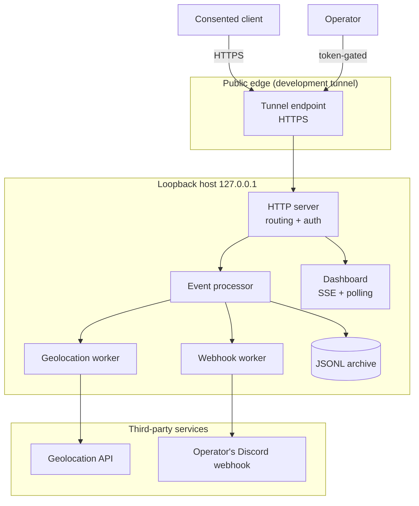
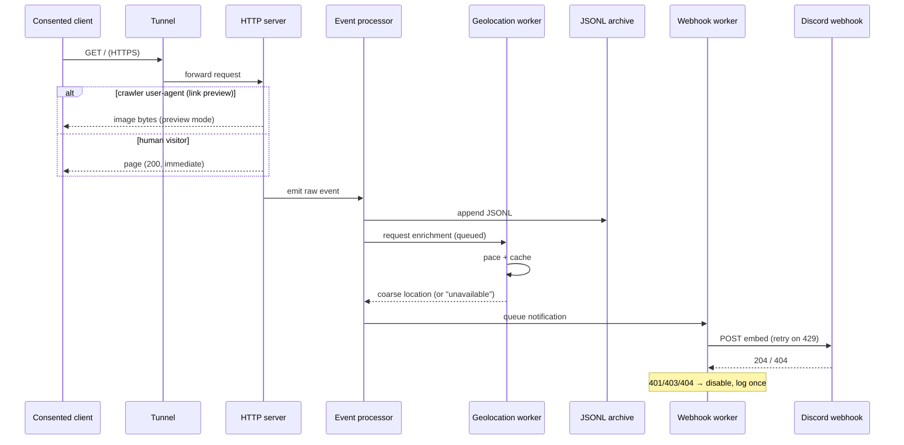
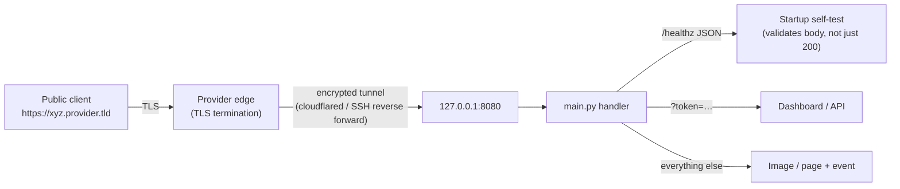
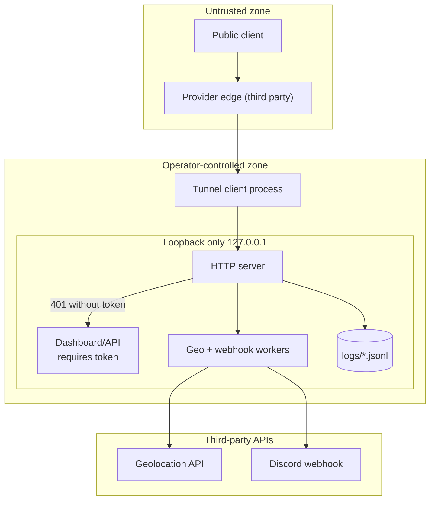
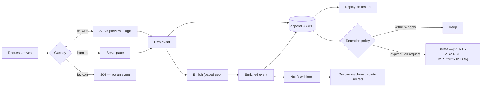

# Architecture

All diagrams are conceptual and defensive: they describe how data flows through
**your own** authorized environment, not how to reach anyone else's.

## 1. Overall architecture

| Component | Responsibility |
|---|---|
| **HTTP server** | Routes crawler vs. human traffic, enforces `dashboard.token`, answers immediately |
| **Event processor** | Normalizes a request into a structured event; drops noise (favicon requests) |
| **Geolocation worker** | Coarse enrichment from a public API, paced and cached |
| **Webhook worker** | Queued outbound embeds, honours `429 retry_after`, self-disables when the webhook is revoked |
| **JSONL archive** | Append-only history, replayed into the dashboard on restart |
| **Dashboard** | Realtime view; SSE primary with automatic polling fallback |
| **Tunnel** | Public HTTPS to a loopback service during development |

## 2. Discord event flow

Key property: **the client is never blocked** by geolocation or webhook
delivery — both happen on background workers.

## 3. HTTP / tunnel flow

Notes:

- The service binds loopback only; the tunnel is the sole ingress.
- Providers change the hostname on restart — never hardcode a public URL.
- The self-test exists because some providers return `200` landing pages for
  unknown paths; only a body check proves the request reached *this* app.

## 4. Security boundary

**Boundary rules**

- Everything left of `TUN` is untrusted input.
- `DASH`/API routes are gated by `dashboard.token` → HTTP 401.
- `FS` holds collected data: git-ignored, protected, subject to retention.
- Outbound calls carry only what the notification needs — no tokens inbound.

## 5. Data lifecycle

**Lifecycle controls that exist today:** append-only archive, replay on
restart, secret rotation by editing `config.json`, webhook self-disable on
revocation.

**Lifecycle controls to implement:** automatic age-based deletion
(`DATA_RETENTION_DAYS`), per-participant deletion requests, and audit logging.
Marked **[VERIFY AGAINST IMPLEMENTATION]** — see [privacy.md](privacy.md).
